## **Table of Contents**
  - [Acknowledgements](#acknowledgements)
  - [Setting up, getting started](#setting-up-getting-started)
  - [Design](#design)
    - [Architecture](#architecture)
    - [UI Component](#ui-component)
    - [Logic Component](#logic-component)
    - [Model Component](#model-component)
    - [Storage Component](#storage-component)
    - [Common classes](#common-classes)
  - [Implementation of features](#implementation)
    - [Add](#add-feature)
    - [Edit](#edit-feature)
    - [Add contact](#add-contact-feature)
    - [Edit contact](#edit-contact-feature)
    - [Delete contact](#delete-contact-feature)
    - [List](#list-feature)
    - [Add documents](#add-documents-feature)
    - [Edit documents](#edit-documents-feature)
    - [Delete documents](#delete-documents-feature)
    - [Edit status](#edit-status-feature)
    - [Archive](#archive-feature)
    - [Unarchive](#unarchive-feature)
    - [List archived applications](#list-archived-applications-feature)
    - [Find](#find-feature)
    - [Sort](#sort-feature)
    - [Clear](#clear-feature)
    - [Clear by](#clear-by-feature)
    - [Delete](#delete-feature)
    - [Revert](#revert-feature)
    - [Revert all](#revert-all-feature)
    - [Remind](#remind-feature)
    - [Exit](#exit-feature)
    - [Add interview date](#add-interview-date-feature)
    - [Side features](#side-features)
      - [Task related features](#task-related-features)
        - [Find task](#find-task-feature)
        - [List task](#list-task-feature)
      - [Todo related features](#todo-related-features)
        - [Add todo](#add-todo-feature)
        - [Clear todo](#clear-todo-feature)
        - [Delete todo](#delete-todo-feature)
        - [Edit deadline](#edit-deadline-feature)
        - [Edit content](#edit-content-feature)
        - [List todo](#list-todo-feature)
      - [Note related features](#note-related-features)
        - [Add note](#add-note-feature)
        - [Clear note](#clear-note-feature)
        - [Delete note](#delete-note-feature)
        - [List note](#list-note-feature)
  - [Documentation, logging, testing, configuration, dev-ops](#documentation-logging-testing-configuration-dev-ops)
  - [Appendix: Requirements](#appendix-requirements)
    - [Product Scope](#product-scope)
    - [User stories](#user-stories)
    - [Use cases](#use-cases)
    - [Non functional requirements](#non-functional-requirements)
    - [Glossary](#glossary)
  - [Appendix: Instructions for manual testing](#appendix-instructions-for-manual-testing)
    - [Launch and Shutdown](#launch-and-shutdown)
  - [Appendix: Planned Enhancement](#appendix-planned-enhancement)

--------------------------------------------------------------------------------------------------------------------

## **Acknowledgements**

* This project is based on the AddressBook-Level3 project created by the [SE-EDU initiative](https://se-education.org).
* Code and documentations reused and adapted from [AB3 project](https://github.com/nus-cs2103-AY2223S2/tp) created by the [SE-EDU initiative](https://se-education.org/).

[Go back to Table of Contents](#table-of-contents)

--------------------------------------------------------------------------------------------------------------------

## **Setting up, getting started**

Refer to the guide [_Setting up and getting started_](SettingUp.md).

[Go back to Table of Contents](#table-of-contents)

--------------------------------------------------------------------------------------------------------------------

## **Design**

:bulb: **Tip:** The `.puml` files used to create diagrams in this document can be found in the [diagrams](https://github.com/AY2223S2-CS2103T-W15-4/tp/tree/master/docs/diagrams/) folder. Refer to the [_PlantUML Tutorial_ at se-edu/guides](https://se-education.org/guides/tutorials/plantUml.html) to learn how to create and edit diagrams.

### Architecture

The ***Architecture Diagram*** given above explains the high-level design of the App.

Given below is a quick overview of main components and how they interact with each other.

**Main components of the architecture**

**`Main`** has two classes called [`Main`](https://github.com/AY2223S2-CS2103T-W15-4/tp/tree/master/src/main/java/seedu/address/Main.java) and [`MainApp`](https://github.com/AY2223S2-CS2103T-W15-4/tp/tree/master/src/main/java/seedu/address/MainApp.java). It is responsible for,
* At app launch: Initializes the components in the correct sequence, and connects them up with each other.
* At shut down: Shuts down the components and invokes cleanup methods where necessary.

[**`Commons`**](#common-classes) represents a collection of classes used by multiple other components.

The rest of the App consists of four components.

* [**`UI`**](#ui-component): The UI of the App.
* [**`Logic`**](#logic-component): The command executor.
* [**`Model`**](#model-component): Holds the data of the App in memory.
* [**`Storage`**](#storage-component): Reads data from, and writes data to, the hard disk.

**How the architecture components interact with each other**

The *Sequence Diagram* below shows how the components interact with each other for the scenario where the user issues the command `delete 1`.

Each of the four main components (also shown in the diagram above),

* defines its *API* in an `interface` with the same name as the Component.
* implements its functionality using a concrete `{Component Name}Manager` class (which follows the corresponding API `interface` mentioned in the previous point.

For example, the `Logic` component defines its API in the `Logic.java` interface and implements its functionality using the `LogicManager.java` class which follows the `Logic` interface. Other components interact with a given component through its interface rather than the concrete class (reason: to prevent outside component's being coupled to the implementation of a component), as illustrated in the (partial) class diagram below.

The sections below give more details of each component.

[Go back to Table of Contents](#table-of-contents)

### UI component

The **API** of this component is specified in [`Ui.java`](https://github.com/AY2223S2-CS2103T-W15-4/tp/blob/master/src/main/java/seedu/address/ui/Ui.java)

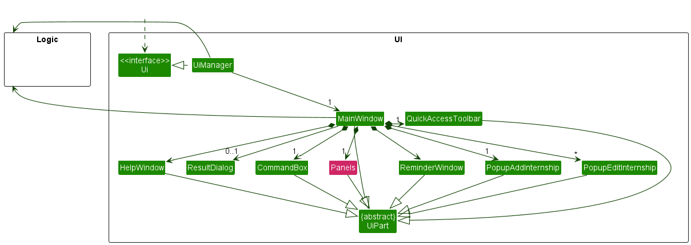  
The reference of the `panels` node is as shown below:  
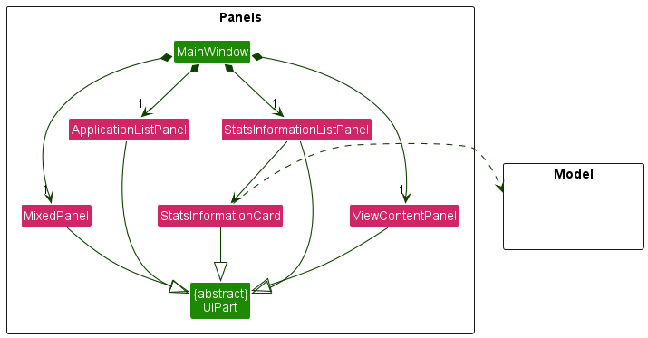  
The detailed components of `MixedPanel` and `ApplicationListPanel` are as shown below:  
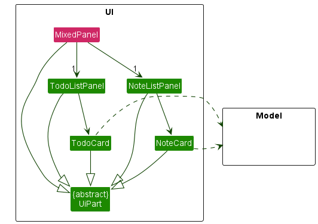   

The UI consists of a `MainWindow` that is made up of parts e.g.`CommandBox`, `MixedPanel`, `NoteListPanel`, `TodoListPanel` etc. All these, including the `MainWindow`, inherit from the abstract `UiPart` class which captures the commonalities between classes that represent parts of the visible GUI.

The `UI` component uses the JavaFx UI framework. The layout of these UI parts are defined in matching `.fxml` files that are in the `src/main/resources/view` folder. For example, the layout of the [`MainWindow`](https://github.com/AY2223S2-CS2103T-W15-4/tp/blob/master/src/main/java/seedu/address/ui/MainWindow.java) is specified in [`MainWindow.fxml`](https://github.com/AY2223S2-CS2103T-W15-4/tp/blob/master/src/main/resources/view/MainWindow.fxml)

The `UI` component,

* executes user commands using the `Logic` component.
* listens for changes to `Model` data so that the UI can be updated with the modified data.
* keeps a reference to the `Logic` component, because the `UI` relies on the `Logic` to execute commands.
* depends on some classes in the `Model` component, as it displays `InternshipApplication` object residing in the `Model`.
* listens on each other in the `Ui` component, as `CommandBox` calls functions in `MainWindow` to `execute()` `Logic`.
* keeps a reference to other `Ui` component, as `MainWindow` keeps references of `MixedPanel`, `NoteListPanel`, `ApplicationListPanel` and `TodoListPanel` to implement the switching between each panel.

[Go back to Table of Contents](#table-of-contents)

### Logic component

**API** : [`Logic.java`](https://github.com/AY2223S2-CS2103T-W15-4/tp/tree/master/src/main/java/seedu/address/logic/Logic.java)

Here's a (partial) class diagram of the `Logic` component:

How the `Logic` component works:
1. When `Logic` is called upon to execute a command, it uses the `InternEaseParser` class to parse the user command.
1. This results in a `Command` object (more precisely, an object of one of its subclasses e.g., `AddCommand`) which is executed by the `LogicManager`.
1. The command can communicate with the `Model` when it is executed (e.g. to add an internship application).
1. The result of the command execution is encapsulated as a `CommandResult` object which is returned back from `Logic`.

The Sequence Diagram below illustrates the interactions within the `Logic` component for the `execute("delete 1")` API call.

:information_source: **Note:** The lifeline for `DeleteCommandParser` should end at the destroy marker (X) but due to a limitation of PlantUML, the lifeline reaches the end of diagram.

Here are the other classes in `Logic` (omitted from the class diagram above) that are used for parsing a user command:

How the parsing works:
* When called upon to parse a user command, the `InternEaseParser` class creates an `XYZCommandParser` (`XYZ` is a placeholder for the specific command name e.g., `AddCommandParser`) which uses the other classes shown above to parse the user command and create a `XYZCommand` object (e.g., `AddCommand`) which the `InternEaseParser` returns back as a `Command` object.
* All `XYZCommandParser` classes (e.g., `AddCommandParser`, `DeleteCommandParser`, ...) inherit from the `Parser` interface so that they can be treated similarly where possible e.g, during testing.

[Go back to Table of Contents](#table-of-contents)

### Model component
**API** : [`Model.java`](https://github.com/AY2223S2-CS2103T-W15-4/tp/tree/master/src/main/java/seedu/address/model/Model.java)

The `Model` component,

* stores the internship applications data i.e., all `InternshipApplication` objects (which are contained in a `UniqueApplicationList` object).
* stores the currently 'selected' `Application` objects (e.g., results of a search query) as a separate _filtered_ list which is exposed to outsiders as an unmodifiable `ObservableList<InternshipApplication>` that can be 'observed' e.g. the UI can be bound to this list so that the UI automatically updates when the data in the list change.
* stores a `UserPref` object that represents the user’s preferences. This is exposed to the outside as a `ReadOnlyUserPref` objects.
* does not depend on any of the other three components (as the `Model` represents data entities of the domain, they should make sense on their own without depending on other components)

[Go back to Table of Contents](#table-of-contents)

### Storage component

**API** : [`Storage.java`](https://github.com/AY2223S2-CS2103T-W15-4/tp/tree/master/src/main/java/seedu/address/storage/Storage.java)

The `Storage` component,
* can save both address book data and user preference data in json format, and read them back into corresponding objects.
* inherits from both `AddressBookStorage` and `UserPrefStorage`, which means it can be treated as either one (if only the functionality of only one is needed).
* depends on some classes in the `Model` component (because the `Storage` component's job is to save/retrieve objects that belong to the `Model`)

[Go back to Table of Contents](#table-of-contents)

### Common classes

Classes used by multiple components are in the `seedu.addressbook.commons` package.

[Go back to Table of Contents](#table-of-contents)

--------------------------------------------------------------------------------------------------------------------

## **Implementation**

This section describes some noteworthy details on how certain features are implemented.

[Go back to Table of Contents](#table-of-contents)

### Add feature

### How add feature is implemented

The `add` command allows users to add an internship application to the tracker. The add mechanism is facilitated by `AddCommand` class. It extends `Command`but overrides the `Command#execute` to add an internship application to the tracker.

The sequence diagram below shows how the `AddCommand` object is created:
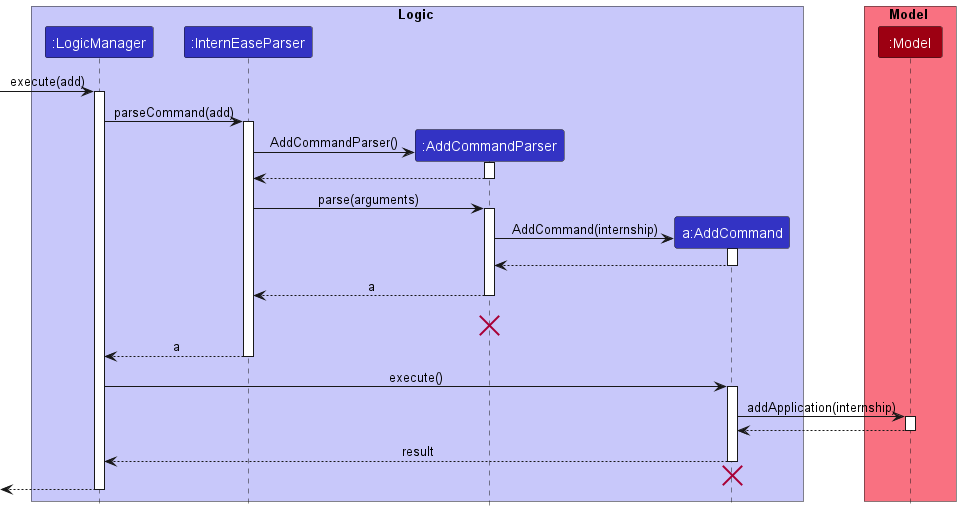

Step 1. Parsing

The `AddCommandParser` checks that the user input is in the expected format, if not an exception will be thrown.

Step 2. Execution

The `AddCommand#execute` calls `Model#addApplication`, causing an update to the internship list.

Step 3. Result

The updated model is then saved. A `CommandResult` object with a message containing the execution result of the command is created and returned to `MainWindow#execute`.

[Go back to Table of Contents](#table-of-contents)

### Edit feature

### How edit feature is implemented

The `edit` command allows users to edit an internship application of the tracker. The edit mechanism is facilitated by `EditCommand` class. It extends `Command`but overrides the `Command#execute` to edit an internship application of the tracker.

The sequence diagram below shows how the `EditCommand` object is created:
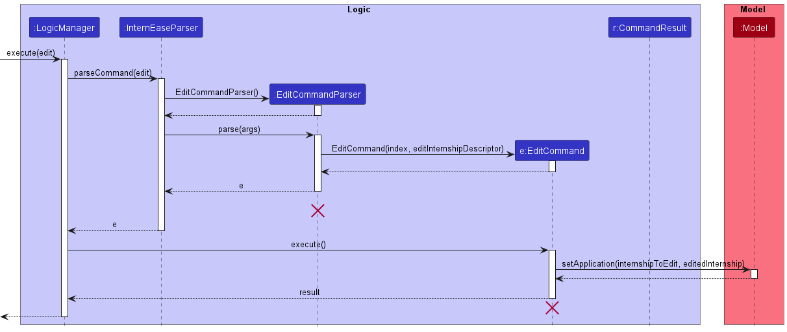

Step 1. Parsing

The `EditCommandParser` checks that the user input is in the expected format, if not an exception will be thrown.

Step 2. Execution

The `EditCommand#execute` calls `Model#setApplication`, causing an update to the internship list.

Step 3. Result

The updated model is then saved. A `CommandResult` object with a message containing the execution result of the command is created and returned to `MainWindow#execute`.

[Go back to Table of Contents](#table-of-contents)

### Add contact feature

#### How is the feature implemented

The `add_contact` command allows users to add the contact of a company to an internship application. The implementation of the `add_contact` command is facilitated by the `AddContactCommand` class which is derived from the `Command` superclass, and overrides the `Command#execute` method. 
The parsing process meanwhile involves the `InternEaseParser#parseCommand`, `ContactParser#parseContactCommand` and the `AddContactCommandParser#parse` methods.

The activity diagram below shows the workflow of the `add_contact` command during its execution.

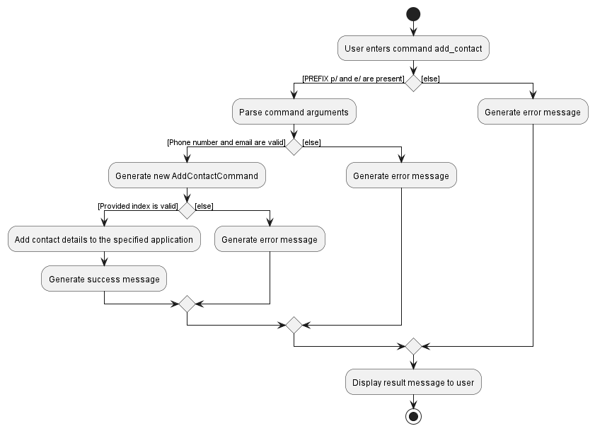

The constructor of the class `AddContactCommand` requires 2 arguments, a valid positive `Integer` index and a `Contact` object, both of which are obtained after the parsing process mentioned above.

The relevant operations from the `Model` interface are `Model#getSortedFilteredInternshipList` and `Model#setApplication`.

A sequence diagram is shown here to illustrate the execution process of the `add_contact` command.

Given below is an explanation on the `add_contact` command's behaviours.

Step 1. Parsing

The `CommandBox#execute` method is invoked when the user's input in `CommandBox` is parsed, which results in the command word being parsed in the method `InternEaseParser#parseCommand` and subsequently the method `ContactParser#parseContactCommand`.
The method `AddContactCommandParser#parse` is invoked only if the command word matches `AddContactCommand.COMMAND_WORD`.

Step 2. Execution

The `AddContactCommand#execute` method is invoked and calls are made to the `model` instance. The last shown list of internships are obtained by calling the method `Model#getSortedFilteredInternshipList`.
The internship application where the contact is to be added is then obtained by calling the `UniqueApplicationList#get` method with the specified index. As the InternshipApplication object is
immutable, a new `InternshipApplication` object is created with the contact details. The `Model#setApplication` method is then invoked to update the specified application in the list.

Step 3. Result

The updated model is then saved. A `CommandResult` object with a message containing the execution result of the command is created and returned to `MainWindow#execute`. 
The `ApplicationListPanel` is refreshed with a `ResultDialog` displaying the returned message for 5 seconds. 

>**NOTE:**
> Error handling: Any error message returned in the midst of execution will be displayed as a `ResultDialog` and the current command executed terminates immediately.

#### Why is it implemented this way

The `AddContactCommand` provides enhancement to the existing `AddCommand` by separating the process of adding contact details of the company from the initial process of
adding a new internship application. This prevents the `AddCommand` from getting cluttered with large amount of arguments that may become difficult for the user to remember. 

**Aspect: Where to save the contact details:**

* **Alternative 1 (current choice):** Separating it into a separate `Contact` class.
    * Pros: Flexibility to add more details to the contact if needed in the future.
    * Cons: More time required to implement.

* **Alternative 2:** Adding contact details as attributes in the `InternshipApplication` class.
    * Pros: Easier than implement.
    * Cons: More conflicts will occur if someone else is working on the `InternshipApplication` class at the same time.

[Go back to Table of Contents](#table-of-contents)

### Edit contact feature

#### How is the feature implemented

The `edit_contact` command allows users to edit the contact of a company added to an internship application. The implementation of the `edit_contact` command is facilitated by the `EditContactCommand` class which is derived from the `Command` superclass, and overrides the `Command#execute` method.
The parsing process meanwhile involves the `InternEaseParser#parseCommand`, `ContactParser#parseContactCommand` and the `EditContactCommandParser#parse` methods.

The activity diagram below shows the workflow of the `edit_contact` command during its execution.

The constructor of the class `EditContactCommand` requires 2 arguments, a valid positive `Integer` index and a `EditContactDescriptor` object, both of which are obtained after the parsing process mentioned above.

The relevant operations from the `Model` interface are `Model#getSortedFilteredInternshipList` and `Model#setApplication`.

A sequence diagram is shown here to illustrate the execution process of the `edit_contact` command.

Given below is an explanation on the `edit_contact` command's behaviours.

Step 1. Parsing

The `CommandBox#execute` method is invoked when the user's input in `CommandBox` is parsed, which results in the command word being parsed in the method `InternEaseParser#parseCommand` and subsequently the method `ContactParser#parseContactCommand`.
The method `EditContactCommandParser#parse` is invoked only if the command word matches `EditContactCommand.COMMAND_WORD`.

Step 2. Execution

The `EditContactCommand#execute` method is invoked and calls are made to the `model` instance. The last shown list of internships are obtained by calling the method `Model#getSortedFilteredInternshipList`.
The internship application where the contact is to be edited is then obtained by calling the `UniqueApplicationList#get` method with the specified index. As the InternshipApplication object is
immutable, a new `InternshipApplication` object is created with the edited contact details. The `Model#setApplication` method is then invoked to update the specified application in the list.

Step 3. Result

The updated model is then saved. A `CommandResult` object with a message containing the execution result of the command is created and returned to `MainWindow#execute`.
The `ApplicationListPanel` is refreshed with a `ResultDialog` displaying the returned message for 5 seconds.

#### Why is it implemented this way

The `EditContactCommand` follows the design intuition behind the `AddContactCommand` by separating the process of editing contact details of the company from the process of
editing other attributes of an existing internship application.

[Go back to Table of Contents](#table-of-contents)

### Delete contact feature

#### How is the feature implemented

The `delete_contact` command allows users to delete the contact of a company added to an internship application. The implementation of the `delete_contact` command is facilitated by the `DeleteContactCommand` class which is derived from the `Command` superclass, and overrides the `Command#execute` method.
The parsing process meanwhile involves the `InternEaseParser#parseCommand`, `ContactParser#parseContactCommand` and the `DeleteContactCommandParser#parse` methods.

The activity diagram below shows the workflow of the `delete_contact` command during its execution.

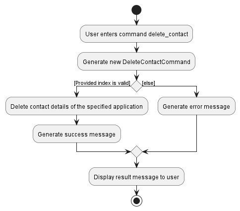

The constructor of the class `DeleteContactCommand` requires 1 argument, a valid positive `Integer` index, which is obtained after the parsing process mentioned above.

The relevant operations from the `Model` interface are `Model#getSortedFilteredInternshipList` and `Model#setApplication`.

A sequence diagram is shown here to illustrate the execution process of the `delete_contact` command.

Given below is an explanation on the `delete_contact` command's behaviours.

Step 1. Parsing

The `CommandBox#execute` method is invoked when the user's input in `CommandBox` is parsed, which results in the command word being parsed in the method `InternEaseParser#parseCommand` and subsequently the method `ContactParser#parseContactCommand`.
The method `DeleteContactCommandParser#parse` is invoked only if the command word matches `DeleteContactCommand.COMMAND_WORD`.

Step 2. Execution

The `DeleteContactCommand#execute` method is invoked and calls are made to the `model` instance. The last shown list of internships are obtained by calling the method `Model#getSortedFilteredInternshipList`.
The internship application where the contact is to be edited is then obtained by calling the `UniqueApplicationList#get` method with the specified index. As the InternshipApplication object is
immutable, a new `InternshipApplication` object is created with the contact details deleted. The `Model#setApplication` method is then invoked to update the specified application in the list.

Step 3. Result

The updated model is then saved. A `CommandResult` object with a message containing the execution result of the command is created and returned to `MainWindow#execute`.
The `ApplicationListPanel` is refreshed with a `ResultDialog` displaying the returned message for 5 seconds.

#### Why is it implemented this way

The `DeleteContactCommand` follows the design intuition behind the `AddContactCommand` by separating the process of deleting contact details of the company from the process of
deleting other attributes of an existing internship application.

[Go back to Table of Contents](#table-of-contents)

### List feature

#### How is the feature implemented

The `list` command lists all ongoing internship applications, i.e. excluding archived applications. Once the list command is executed,
it updates the `predicate` of `FilteredInternshipList` in `model` to show only currently ongoing applications. All commands to be executed following this command
will follow the index of the latest list displayed in the internship application panel.

The execution process of `list_archived` is demonstrated by the activity diagram below.

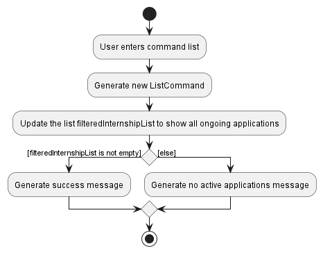

[Go back to Table of Contents](#table-of-contents)

### Add documents feature

#### How is the feature implemented

The `add_docs` command allows users to add links of the documents submitted to a company to an internship application. The implementation of the `add_docs` command is facilitated by the `AddDocumentsCommand` class which is derived from the `Command` superclass, and overrides the `Command#execute` method.
The parsing process meanwhile involves the `InternEaseParser#parseCommand`, `DocumentsParser#parseDocumentsCommand` and the `AddDocumentsCommandParser#parse` methods.

The activity diagram below shows the workflow of the `add_docs` command during its execution.

The constructor of the class `AddDocumentsCommand` requires 2 arguments, a valid positive `Integer` index and a `Documents` object, both of which are obtained after the parsing process mentioned above.

The relevant operations from the `Model` interface are `Model#getSortedFilteredInternshipList` and `Model#setApplication`.

A sequence diagram is shown here to illustrate the execution process of the `add_docs` command.

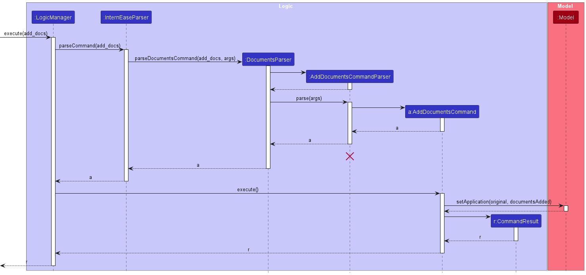

Given below is an explanation on the `add_docs` command's behaviours.

Step 1. Parsing

The `CommandBox#execute` method is invoked when the user's input in `CommandBox` is parsed, which results in the command word being parsed in the method `InternEaseParser#parseCommand` and subsequently the method `DocumentsParser#parseDocumentsCommand`.
The method `AddDocumentsCommandParser#parse` is invoked only if the command word matches `AddDocumentsCommand.COMMAND_WORD`.

Step 2. Execution

The `AddDocumentsCommand#execute` method is invoked and calls are made to the `model` instance. The last shown list of internships are obtained by calling the method `Model#getSortedFilteredInternshipList`.
The internship application where the document links are to be added is then obtained by calling the `UniqueApplicationList#get` method with the specified index. As the InternshipApplication object is
immutable, a new `InternshipApplication` object is created with the document links. The `Model#setApplication` method is then invoked to update the specified application in the list.

Step 3. Result

The updated model is then saved. A `CommandResult` object with a message containing the execution result of the command is created and returned to `MainWindow#execute`.
The `ApplicationListPanel` is refreshed with a `ResultDialog` displaying the returned message for 5 seconds.

#### Why is it implemented this way

The `AddDocumentsCommand` provides enhancement to the existing `AddCommand`, in a similar fashion to the `AddContactCommand`.

[Go back to Table of Contents](#table-of-contents)

### Edit documents feature

#### How is the feature implemented

The `edit_docs` command allows users to edit links of the documents submitted to a company to an internship application. The implementation of the `edit_docs` command is facilitated by the `EditDocumentsCommand` class which is derived from the `Command` superclass, and overrides the `Command#execute` method.
The parsing process meanwhile involves the `InternEaseParser#parseCommand`, `DocumentsParser#parseDocumentsCommand` and the `EditDocumentsCommandParser#parse` methods.

The execution process of the `edit_docs` command can be demonstrated by the activity diagram of `edit_contact` by replacing `contact` related phrases or methods with `documents` related phrases or methods.

> [Edit Contact Feature](#edit-contact-feature)

[Go back to Table of Contents](#table-of-contents)

### Delete documents feature

#### How is the feature implemented

The `delete_docs` command allows users to delete links of the documents added to an internship application. The implementation of the `edit_docs` command is facilitated by the `DeleteDocumentsCommand` class which is derived from the `Command` superclass, and overrides the `Command#execute` method.
The parsing process meanwhile involves the `InternEaseParser#parseCommand`, `DocumentsParser#parseDocumentsCommand` and the `DeleteDocumentsCommandParser#parse` methods.

The execution process of the `delete_docs` command can be demonstrated by the activity diagram of `delete_contact` by replacing `contact` related phrases or methods with `documents` related phrases or methods.

> [Delete Contact Feature](#delete-contact-feature)

[Go back to Table of Contents](#table-of-contents)

### Edit status feature

#### How is the feature implemented

The `edit_status` command allows users to edit the status of an internship application. The implementation of the `edit_status` command is facilitated by the `EditStatusCommand` class which is derived from the `Command` superclass, and overrides the `Command#execute` method.
The parsing process meanwhile involves the `InternEaseParser#parseCommand` and the `EditStatusCommandParser#parse` methods.

The activity diagram below shows the workflow of the `edit_status` command during its execution.

The constructor of the class `EditStatusCommand` requires 2 arguments, a valid positive `Integer` index and a `InternshipStatus` object, both of which are obtained after the parsing process mentioned above.

The relevant operations from the `Model` interface are `Model#getSortedFilteredInternshipList` and `Model#setApplication`.

A sequence diagram is shown here to illustrate the execution process of the `edit_contact` command.

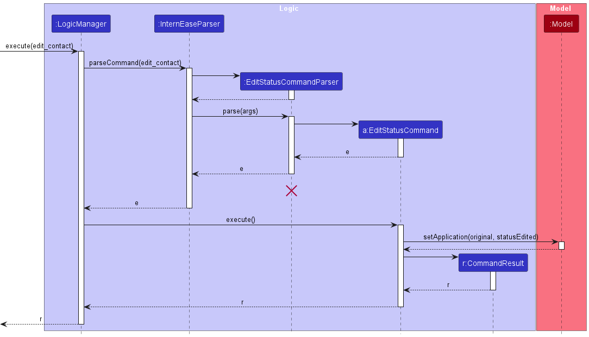

Given below is an explanation on the `edit_status` command's behaviours.

Step 1. Parsing

The `CommandBox#execute` method is invoked when the user's input in `CommandBox` is parsed, which results in the command word being parsed in the method `InternEaseParser#parseCommand`.
The method `EditStatusCommandParser#parse` is invoked only if the command word matches `EditStatusCommand.COMMAND_WORD`.

Step 2. Execution

The `EditContactCommand#execute` method is invoked and calls are made to the `model` instance. The last shown list of internships are obtained by calling the method `Model#getSortedFilteredInternshipList`.
The internship application where the status is to be edited is then obtained by calling the `UniqueApplicationList#get` method with the specified index. As the InternshipApplication object is
immutable, a new `InternshipApplication` object is created with the new status. The `Model#setApplication` method is then invoked to update the specified application in the list.

Step 3. Result

The updated model is then saved. A `CommandResult` object with a message containing the execution result of the command is created and returned to `MainWindow#execute`.
The `ApplicationListPanel` is refreshed with a `ResultDialog` displaying the returned message for 5 seconds.

#### Why is it implemented this way

The `EditStatusCommand` follows the design intuition behind the `EditContactCommand` by separating the process of editing status of the internship application from the process of
editing other attributes of an existing internship application.

[Go back to Table of Contents](#table-of-contents)

### Archive feature

#### How is the feature implemented

The `archive` command allows users to archive an internship application. The implementation of the `archive` command is facilitated by the `ArchiveCommand` class which is derived from the `Command` superclass, and overrides the `Command#execute` method.
The parsing process meanwhile involves the `InternEaseParser#parseCommand` and the `ArchiveCommandParser#parse` methods.

The activity diagram below shows the workflow of the `archive` command during its execution.

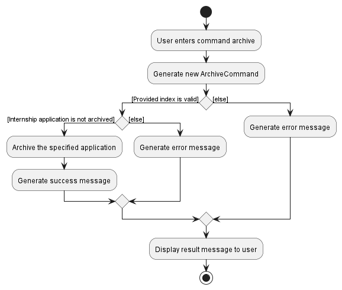

The constructor of the class `ArchiveCommand` requires 1 argument, a valid positive `Integer` index, which is obtained after the parsing process mentioned above.

The relevant operations from the `Model` interface are `Model#getSortedFilteredInternshipList` and `Model#setApplication`.

A sequence diagram is shown here to illustrate the execution process of the `archive` command.

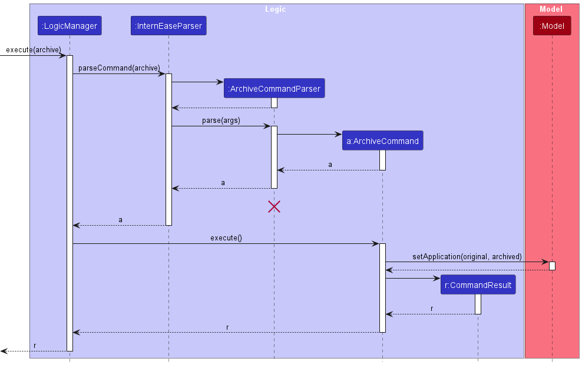

Given below is an explanation on the `archive` command's behaviours.

Step 1. Parsing

The `CommandBox#execute` method is invoked when the user's input in `CommandBox` is parsed, which results in the command word being parsed in the method `InternEaseParser#parseCommand`.
The method `ArchiveCommandParser#parse` is invoked only if the command word matches `ArchiveCommand.COMMAND_WORD`.

Step 2. Execution

The `ArchiveCommand#execute` method is invoked and calls are made to the `model` instance. The last shown list of internships are obtained by calling the method `Model#getSortedFilteredInternshipList`.
The internship application to be archived is then obtained by calling the `UniqueApplicationList#get` method with the specified index. As the InternshipApplication object is
immutable, a new archived `InternshipApplication` object is created. The `Model#setApplication` method is then invoked to update the specified application in the list.

Step 3. Result

The updated model is then saved. A `CommandResult` object with a message containing the execution result of the command is created and returned to `MainWindow#execute`.
The `ApplicationListPanel` is refreshed with a `ResultDialog` displaying the returned message for 5 seconds.

#### Why is it implemented this way

The `ArchiveCommand` allows an internship application to be archived in an easier way, as otherwise the user would have to remember a specific prefix
if it is implemented as part of the `EditCommand`.

[Go back to Table of Contents](#table-of-contents)

### Unarchive feature

#### How is the feature implemented

The `unarchive` command allows users to unarchive an internship application. The implementation of the `unarchive` command is facilitated by the `UnarchiveCommand` class which is derived from the `Command` superclass, and overrides the `Command#execute` method.
The parsing process meanwhile involves the `InternEaseParser#parseCommand` and the `UnarchiveCommandParser#parse` methods.

The execution process of the `unarchive` command can be demonstrated by the activity diagram of `archive` by replacing `archive` related phrases or methods with `unarchive` related phrases or methods.

> [Archive Feature](#archive-feature)

### List archived applications feature
#### How is the feature implemented

The `list_archived` command lists all currently archived internship applications. The implementation of the `list_archived` command is facilitated by the `ListArchivedCommand` class which is derived from the `Command` superclass, and overrides the `Command#execute` method.
The execution of the `ListArchivedCommand` is similar to the `ListCommand`.

The execution process of `list_archived` is demonstrated by the activity diagram below.

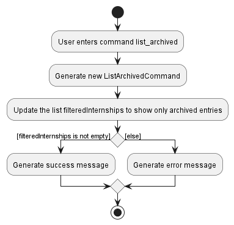

[Go back to Table of Contents](#table-of-contents)

### Find feature

The `find` command allows user to find all `InternshipApplication` whose 
1. `CompanyName` and `JobTitle` contain the specified keyword, or
2. `Internship status` contain the specified status, or
3. `InterviewDate` is before, after, or between specified date(s).

>**NOTE:**
> The matching of keyword in `CompanyName` and `JobTitle` is case-insensitive. As long as one word within CompanyName` 
> and `JobTitle` matches any of the KEYWORDS, it will be shown in result.

#### How is the feature implemented

The sequence diagram below describes the interaction between classes when find command is entered.

Step 1. Parsing

If the command word matches the word "find", `FindCommandParser#parse()` will be called to parse 
the argument of find. The parsing logic is further divided into three cases below:
- Case 1: If the prefix `s/` is specified, the argument that follows the prefix immediately is 
deemed as `InternshipStatus`. A `FindStatusCommand` with `StatusPredicate` is created to be executed. 
- Case 2: If one of the following prefixes `before/`, `after/`, OR `from/` and `to/` is specified, the argument
that follows immediately is deemed as `InterviewDate`. A `FindDateCommand` with appropriate subclasses of
`DatePredicate` is created to be executed. 
- Case 3: If none of the prefix among `s/`, `before/`, `after/`, `from/`, `to/` is specified 
in the argument. `FindCommandParser` constructs a `FindCommand` object and treat all arguments that follow as `KEYWORD`

Step 2. Execution

The corresponding command is then invoked. Within each command's `execute` method, 
`Model#updateFilteredInternshipList()` is invoked by passing in the predicate. For Cases 1 and 2, 
only those `InternshipApplication`'s with matching `ApplicationStatus` or `InterviewDate` are added to the Model's
`filteredInternships` whereas for Case 3, if any word within the `CompanyName` or `JobTitle` matches one of the 
`KEYWORD`(s), then that application is added to the Model's `filteredInternships`.

Step 3. Result

The updated model is then saved. A `CommandResult` object with a message containing the execution result of the command 
is created and returned to `MainWindow#execute`. The `ApplicationListPanel` is refreshed with a `ResultDialog` 
displaying the returned message for 5 seconds.

#### Why is it implemented this way

The class diagram below shows current structure of classes related to `find` command.

It is designed and implemented in this way to make the find command more extensible to further enhancement to be made.
For example, developer may want to enable more prefixes that be searched using the search command. By the 
use of inheritance, one can easily modify the behaviour of `find` command through overrding of the `execute` command
and rely on polymorphism.

#### Alternatives considered

**Syntax of `find` command**

* **Alternative 1 (current choice):** Now to find attribute in `InternshipApplication`, the command syntax used is
by using its prefix, i.e. in this form `find s/PENDING`. 
  * Pros: shorter command
  * Cons: Parser logic is harder to maintain as compared to Alternative 2

* **Alternative 2:** We can also make it in such format find_<Attribute>, e.g. find_status. 
  * Pros: Easy parser to implement
  * Cons: Longer command which takes longer time to type

[Go back to Table of Contents](#table-of-contents)

### Sort feature

The `sort` command allows user to sort all `InternshipApplication` by the order below:
1. `CompanyName` (alphabetical order)
2. `JobTitle` (alphabetical order)
3. `Internship status` (the default order of status)
4. `InterviewDate` (ascending order of the interview date, `InternshipApplication` having null values are placed at the end).

>**NOTE:**
> The alphabetical order for comparing `CompanyName` and `JobTitle` is case-insensitive. To illustrate, the 
> `InternshipApplication` with `CompanyName` "amazon" should appear before that with `CompanyName` "Google".

#### How is the feature implemented

The sequence diagram below describes the interaction between classes when sort command is entered.

Step 1. Parsing

If the command word matches the word "sort", `SortCommandParser#parse()` will be called to parse
the argument of sort. Depending on the argument of sort, the corresponding comparator will be created. The sort command
is then created with appropriate comparator.

Step 2. Execution

The SortCommand#execute method is then invoked. The `Model#updateSortedFilteredInternshipList()` is invoked by passing in the comparator. 
The underlying `SortedList` is the updated and sorted by using the Comparator being passed.

Step 3. Result

The updated model is then saved. A `CommandResult` object with a message containing the execution result of the command
is created and returned to `MainWindow#execute`. The `ApplicationListPanel` is refreshed with a `ResultDialog`
displaying the returned message for 5 seconds.

#### Why is it implemented this way

It is designed and implemented in this way to make the sort command more extensible to further enhancement to be made.
For example, developer may want to provide more sorting order using the sort command. By the
use of inheritance, one can easily enhance the `sort` command by passing appropriate implementation of `Comparator` object
to sort the underlying list of `InternshipApplication`'s by polymorphism.

[Go back to Table of Contents](#table-of-contents)

### Clear feature
This section elaborated the `clear` feature by its functionality and the path of execution together with the `ClearCommand` implementation. Uml diagram is used to aid this description.

#### How CLEAR Feature is implemented

The `clear` feature enables user to clear all internship applications in the current internship application list.

The execution process of `clear` is demonstrated by the sequence diagram below.

Given below is a step-wise explanation on `clear` mechanism's behaviour.

Step 1. Parsing  
The user input in the `CommandBox` will trigger `CommandBox#execute`, will result in the command word processing in `InternEaseParser#parse`. If the `COMMAND.WORD` matches `clear`.

Step 2. Execution  
`ClearCommand#execute` is called with `model` instance. It attempts to get full list of `Internship Applications` by `Model#getSortedFilteredInternshipList`.
If the application list is currently not empty, `Model#setInternEase` empties the application list by replacing it with a new InternEase instance while `Model#addAllInternshipToCache` adds the entire list into the cacheList.

Step 3. Result  
The result model is saved. A `CommandResult` with execution result message is returned until the `MainWindow#execute`. The `ApplicationListPanel` is refreshed with a `ResultDialog` displaying the execution message for 5 seconds.

>**NOTE:**  
> Error handling: Any error message resulted in the midst of execution will be displayed as a `ResultDialog` and current execution terminates immediately.

#### Why is it implemented this way

The `ClearFeature` is an enhanced extension for the `DeleteFeature`. It provides an execution for a series operations of the `DeleteCommands` at once. Furthermore, it is made reversible by adding the entries into a cacheList immediately after clearing them.

[Go back to Table of Contents](#table-of-contents)

### Clear By feature
This section elaborated the `clear_by` feature by its functionality and the path of execution together with the `ClearByCommand` implementation. Uml diagrams are used to aid this description.

#### How CLEAR_BY Feature is implemented

The `clear_by` feature enables user to clear the internship applications in batch with the specific attribute and the specific keyword. There are 3 cases (attributes) available in this feature.
In `Logic` interface, `ClearByCommand` extends `Command` with a `ClearByCommand#execute` functionality. The parsing process is facilitated by both the `InternEaseParser#parse` and `ClearByCommandParser#parse`.

The workflow of a `clear_by` command during its execution is shown by the activity diagrams below, the alternatives of the main diagrams are shown in 3 break-downs activity diagram below:
  
Group - Company Name  
  
Group - Job Title  
  
Group - Status  
  

There are 3 constructors `ClearByCommand::new` provided for 3 different cases stated below : 

* Case 1 : clear_by `COMPANY_NAME`
  * `PREFIX` should be set to `n`
  * Allows user to remove all internship applications with `ParamType=COMPANY_NAME` **fully match** with the entire provided keyword (case-sensitive).
  
* Case 2 : clear_by `JOB_TITLE`
  * `PREFIX` should be set to `j`
  * Allows user to remove all internship applications with `ParamType=JOB_TITLE` **fully match** with the entire provided keyword (case-sensitive).
  
* Case 3 : clear_by `STATUS`
  * `PREFIX` should be set to `s`, the keywords accepted include `ACCEPTED, PENDING, RECEIVED, REJECTED, DECLINED`.
  * Allows user to remove all internship applications with `ParamType=STATUS` **fully match** with the correct provided keyword (case-sensitive).

>**Note:** 
> The assignation of cases will be done by `ClearByCommandParser#parse`, each unavailable fields will be set to null.

These operations are involved in the `Model` interface as `Model#getSortedFilteredInternshipList`, `Model#addInternshipToCache` and `Model#deleteInternship`

The execution process of `Clear_by` is demonstrated by the sequence diagram below.

Given below is a step-wise explanation on `clear_by` mechanism's behaviour.

Step 1. Parsing  
    The user input in the `CommandBox` will trigger `CommandBox#execute`, will result in the command word processing in `InternEaseParser#parse`. If the `COMMAND.WORD` matches `clear_by`, it will then be passed to `ClearByCommandParser#parse`.
    The `PREFIX` in the argument will then be investigated. Different constructor of `ClearByCommand` object will be using based on the `PREFIX`.

Step 2. Execution  
    `ClearByCommand#execute` is called with `model` instance. It attempts to get full list of `Internship Applications` by `Model#getSortedFilteredInternshipList`. Then, the list is filtered by `ClearByCommand#getFilteredList` to filter out the applications to be cleared.
    The size of the list-to-clear is checked before an iteration to `Model#deleteInternship` and `Model#addInternshipToCache`. The cleared items are stored in the cacheList to support `RevertCommand` in current InternEase session.
    
Step 3. Result  
    The result model is saved. A `CommandResult` with execution result message is returned until the `MainWindow#execute`. The `ApplicationListPanel` is refreshed with a `ResultDialog` displaying the execution message for 5 seconds.

>**NOTE:**  
> Error handling: Any error message resulted in the midst of execution will be displayed as a `ResultDialog` and current execution terminates immediately.

#### Why is it implemented this way

The `ClearByCommand` is an enhanced feature for both `DeleteCommand` and `ClearCommand`. It resolves user's request to perform customized batch deletion of internship applications.
Based on utility, the 3 fixed fields in an internship application are taken as the key attributes for this `clear_by` feature. The `PREFIX` for specifying the `clear_by` attribute is also the same as InternEase convention.
For the ease of implementation and avoid ambiguity, constructor `ClearByCommand::new` is overloaded, taking different fields. The usage of enum `ParamType` to specify the operating attribute type generalized the `ClearByCommand#execute`.
The other implementation aspects of `clear_by` feature follow the convention of `InternEase`.

[Go back to Table of Contents](#table-of-contents)

### Delete feature
This section elaborated the `delete` feature by its functionality and the path of execution together with the `DeleteCommand` implementation. Uml diagram is used to aid this description.

#### How DELETE Feature is implemented

The `delete` feature enables user to delete an internship applications with the specified index. 
In `Logic` interface, `DeleteCommand` extends `Command` with a `DeleteCommand#execute` functionality. The parsing process is facilitated by both the `InternEaseParser#parse` and `DeleteCommandParser#parse`.

All the delete operations should only have `INDEX` within the displayed Internship Application List.
The deleted application(s) in current session (after InternEase initialization, before exit) will be cached in a cacheList to enable the `revert` and `revert_all` features.

These operations are involved in the `Model` interface as `Model#getSortedFilteredInternshipList`, `Model#addInternshipToCache` and `Model#deleteInternship`

The execution process of `delete` is demonstrated by the sequence diagram below.

Given below is a step-wise explanation on `delete` mechanism's behaviour.

Step 1. Parsing  
The user input in the `CommandBox` will trigger `CommandBox#execute`, will result in the command word processing in `InternEaseParser#parse`. If the `COMMAND.WORD` matches `delete`, it will then be passed to `DeleteCommandParser#parse`.
The `INDEX` in the argument will then be investigated.

Step 2. Execution  
`DeleteCommand#execute` is called with `model` instance. It attempts to get full list of `Internship Applications` by `Model#getSortedFilteredInternshipList`. The `INDEX` is checked against the size of the current Internship Application to ensure that it is within the desired range.
The `internshipToDelete` is retrieved from the filteredList and deleted from the model by `Model#deleteInternship`. The deleted item is stored in the cacheList to support `RevertCommand` and `RevertAllCommand` in the current InternEase session.

Step 3. Result  
The result model is saved. A `CommandResult` with execution result message is returned until the `MainWindow#execute`. The `ApplicationListPanel` is refreshed with a `ResultDialog` displaying the execution message for 5 seconds.

>**NOTE:**  
> Error handling: Any error message resulted in the midst of execution will be displayed as a `ResultDialog` and current execution terminates immediately.

#### Why is it implemented this way

The `DeleteCommand` is a common, must-have feature which helps to clean-up unwanted internship applications to enhance user experience. The cacheList provides an extra protection to the data to buffer the effect of this destructive operation.

[Go back to Table of Contents](#table-of-contents)

### Revert feature
This section elaborated the `revert` feature by its functionality and the path of execution together with the `RevertCommand` implementation. Uml diagram is used to aid this description.

#### How REVERT Feature is implemented

The `revert` feature enables user to revert the most recent deleted internship applications.
In `Logic` interface, `RevertCommand` extends `Command` with a `RevertCommand#execute` functionality. The parsing process is facilitated by the `InternEaseParser#parse`.

All the revert operations can be operated when the cacheList for the current session is not empty.
The reverted application(s) in current session (after InternEase initialization, before exit) will be removed from the cacheList and be added to the end of the current internship application list.

These operations are involved in the `Model` interface as `Model#getCachedInternshipList`, `Model#getAndRemoveCachedApplication` and `Model#addApplication`.

The execution process of `revert` is demonstrated by the activity diagram below.

Given below is a step-wise explanation on `revert` mechanism's behaviour.

Step 1. Parsing  
The user input in the `CommandBox` will trigger `CommandBox#execute`, will result in the command word processing in `InternEaseParser#parse`. If the `COMMAND.WORD` matches `revert`.

Step 2. Execution  
`RevertCommand#execute` is called with `model` instance. It attempts to get full list of `cached Internship Applications` by `Model#getCachedInternshipList`. 
The `most recent cached Internship Application` is retrieved from the cacheList and deleted from it by `Model#getAndRemoveCachedApplication`. The retrieved item is added back to the end of the internship application list by `Model#addApplication`.

Step 3. Result  
The result model is saved. A `CommandResult` with execution result message is returned until the `MainWindow#execute`. The `ApplicationListPanel` is refreshed with a `ResultDialog` displaying the execution message for 5 seconds.

>**NOTE:**  
> Error handling: Any error message resulted in the midst of execution will be displayed as a `ResultDialog` and current execution terminates immediately.

#### Why is it implemented this way

The `RevertFeature` adds an extra cacheList provides an extra protection to the data to counter the destructive effect of the `ClearFeatures` and the `DeleteFeature`. The cacheList does not write in the memory space to provide
a temporary data-storing data structure that acts as a buffer for the current session's operations.

#### Alternatives considered

**Functionality of `revert` command**

* **Alternative 1 (current choice):** Currently, only the revert of a single deleted / cleared internship application is available. 
    * Pros: Shorter command, easy to implement.
    * Cons: Less efficient as compared to Alternative 2.

* **Alternative 2:** We can also make it in such format `revert INDEX`, e.g. revert 3 (reverts 3 most recent deleted internship applications).
    * Pros: More powerful feature.
    * Cons: More complicate to implement.

[Go back to Table of Contents](#table-of-contents)

### Revert All feature
This section elaborated the `revert_all` feature by its functionality and the path of execution together with the `RevertAllCommand` implementation. Uml diagram is used to aid this description.

#### How REVERT_ALL Feature is implemented

The `revert_all` feature enables user to revert all deleted and cleared internship applications in the current session (after InternEase initialization, before exit).

The execution process of `revert_all` is demonstrated by the sequence diagram below.

Given below is a step-wise explanation on `revert_all` mechanism's behaviour.

Step 1. Parsing  
The user input in the `CommandBox` will trigger `CommandBox#execute`, will result in the command word processing in `InternEaseParser#parse`. If the `COMMAND.WORD` matches `revert_all`.

Step 2. Execution  
`RevertAllCommand#execute` is called with `model` instance. It attempts to get full list of `cached Internship Applications` by `Model#getCachedInternshipList`.
If the cacheList is currently not empty, `Model#setEmptyInternshipCacheList` empties the cacheList while `Model#addApplications` adds the entire list to the end of the current internship application list.

Step 3. Result  
The result model is saved. A `CommandResult` with execution result message is returned until the `MainWindow#execute`. The `ApplicationListPanel` is refreshed with a `ResultDialog` displaying the execution message for 5 seconds.

>**NOTE:**  
> Error handling: Any error message resulted in the midst of execution will be displayed as a `ResultDialog` and current execution terminates immediately.

#### Why is it implemented this way

The `RevertAllFeature` is an enhanced extension for the `RevertFeature`. It provides an execution for the series operations of the `RevertFeatures` at once.

[Go back to Table of Contents](#table-of-contents)

### Remind feature
This section elaborated the `remind` by its functionality and the path of execution together with the RemindCommand implementation.

#### How Remind Feature is implemented
The `remind` feature enables users to view the details of the application with the most imminent interview date.

Given below is a step-wise explanation on `remind` mechanism's behaviour.

Step 1. Parsing 

The user input in the `CommandBox` will trigger `CommandBox#execute`, will result in the command word processing in `InternEaseParser#parse`. If the `COMMAND.WORD` matches `remind`.

Step 2. Execution

`RemindCommand#Execute` is called with a model instance. It directly returns a command result with `showReminder` set to `True`.

Step 3. Result 

A `CommandResult` with execution result message is returned until the `MainWindow#execute`. The `ResultDialog` displays the execution message for 5 seconds. `MainWindow#handleReminder` handles the remind operation by showing or focusing on the reminder window.

>**NOTE:**  
> Error handling: Any error message resulted in the midst of execution will be displayed as a `ResultDialog` and current execution terminates immediately.

#### Why is it implemented this way

The `RemindFeature` is a good to have feature. Existing reminder window is cleaned-up upon executing commands to prevent multiple windows from clogging up the screen.

[Go back to Table of Contents](#table-of-contents)

### Exit feature
This section elaborated the `exit` feature by its functionality and the path of execution together with the `ExitCommand` implementation. Uml diagram is used to aid this description.

#### How Exit Feature is implemented

The `exit` feature enables user to close InternEase using CLI command.

The execution process of `exit` is demonstrated by the sequence diagram below.

Given below is a step-wise explanation on `exit` mechanism's behaviour.

Step 1. Parsing  
The user input in the `CommandBox` will trigger `CommandBox#execute`, will result in the command word processing in `InternEaseParser#parse`. If the `COMMAND.WORD` matches `exit`.

Step 2. Execution  
`ExitCommand#execute` is called with `model` instance. It directly returns a command result with `exit` parameter being set to `True`. 

Step 3. Result  
A `CommandResult` with execution result message is returned until the `MainWindow#execute`. The `ResultDialog` displays the execution message for 5 seconds.
`MainWindow#handleExit` handle the exit operation by recording current gui settings and hiding all the opened windows. The InternEase software shuts down eventually.

>**NOTE:**  
> Error handling: Any error message resulted in the midst of execution will be displayed as a `ResultDialog` and current execution terminates immediately.

#### Why is it implemented this way

The `ExitFeature` is a general, must-have feature. All the windows are cleaned-up upon exit to prevent illegal running of InternEase processes and the trigger of null-pointer exceptions.
The `ExitFeature` also acts as the termination point for cacheList usage in the current session.

[Go back to Table of Contents](#table-of-contents)

### Add Interview Date feature 

#### How is the feature implemented

The `add_date` command allows users to add an interview date to an internship application. The implementation of the `add_date` command is facilitated by the `AddInterviewDateCommand` class which is derived from the `Command` superclass, and overrides the `Command#execute` method.
The parsing process meanwhile involves the `AddressBookParser#parse#` and the `AddInterviewDateCommandParser#parse` methods.

The constructor of the class `AddInterviewDateCommand` requires 2 arguments, a valid positive `Integer` index and a `InterviewDate` object, both of which are obtained after the parsing process mentioned above.

The relevant operations from the `Model` interface are `Model#getFilteredInternshipList`, `Model#setApplication` and `Model#updateFilteredInternshipList`.

Given below is an explanation on the `add_date` command's behaviours.

Step 1. Parsing

The `CommandBox#execute` method is invoked when the user's input in `CommandBox` is parsed, which results in the command word being parsed in the method `InternEaseParser#parser`.
The method `AddInterviewDateCommandParser#parse` is invoked only if the command word matches `AddInterviewDateCommand.COMMAND_WORD`.

Step 2. Execution

The `AddInterviewDateCommand#execute` method is invoked and calls are made to the `model` instance. The last shown list of internships are obtained by calling the method `Model#getFilteredInternshipList`.
The internship application where the interview date is to be added is then obtained by calling the `UniqueApplicationList#get` method with the specified index. As the InternshipApplication object is
immutable, a new `InternshipApplication` object is created with the interview date. The `Model#setApplication` method is then invoked to update the specified application in the list.

Step 3. Result

The updated model is then saved. A `CommandResult` object with a message containing the execution result of the command is created and returned to `MainWindow#execute`.
The `ApplicationListPanel` is refreshed with a `ResultDialog` displaying the returned message for 5 seconds.

>**NOTE:**
> Error handling: Any error message returned in the midst of execution will be displayed as a `ResultDialog` and the current command executed terminates immediately.

#### Why is it implemented this way

The `AddInterviewDateCommand` provides enhancement to the existing `AddCommand` by separating the process of adding the interview date for an application from the initial process of
adding a new internship application. This prevents the `AddCommand` from getting cluttered with large amount of arguments that may become difficult for the user to remember.

**Aspect: Where to save the contact details:**

* **Alternative 1 (current choice):** Separating it into a separate `InterviewDate` class.
    * Pros: Flexibility to add more details to the contact if needed in the future.
    * Cons: More time required to implement.

* **Alternative 2:** Adding interview date as an attribute in the `InternshipApplication` class.
    * Pros: Easier than implement.
    * Cons: More conflicts will occur if someone else is working on the `InternshipApplication` class at the same time.

[Go back to Table of Contents](#table-of-contents)

### Side Features
**All the side features share similar execution paths as their respective main features execution logic, only minor changes are applied.**

For example, the main differences in these features are on the specific functions used to carry out the execution and the specific lists used to store the relevant items.  
  - `Task` is a combination of `Todo` and `Note`. 
  - `TodoList` or `NoteList` are used instead of the list of InternshipApplications with their related methods. 
  - Methods with `Todo` or `Note` are used instead of `Application` or `Internship` (e.g., updateFiltered`Todo`List and updateFiltered`Note`List are used instead of updateFiltered`Internship`List). 
  - CacheList is not applicable here. 
  - All the commands (include main features) can be executed in any of the panels. It will automatically switch to the related panel and display the results after every execution. 
  - All commands here need to go through the `TaskParser` after being processed in the `InternEaseParser`. 
  - For GUI settings, `Todo` uses `TodoListPanel`, `Note` uses `NoteListPanel`, while `Task` uses `MixedPanel`. 

[Go back to Table of Contents](#table-of-contents)
  
### Task related features
### Find Task feature
#### How is the feature implemented

The `FindTaskFeature` provides searching function on `Todo` and `Note` with keywords.
The execution of `FindTaskCommand` is similar to `FindCommand` except it takes no prefix(purely keywords) and it searches on `InternshipTodo` company name and `Note` content.

The execution process of `find_task` is demonstrated by the sequence diagram below. 

#### Why is it implemented this way

The `FindFeature` on `InternshipTodo` and `Note` are put together as `FindTaskFeature` because they have the same characteristic as a `Task`. It will enable the planning of internship
application to be more effective.

[Go back to Table of Contents](#table-of-contents)

### List Task feature
#### How is the feature implemented

The `ListTaskFeature` lists both `TodoList` and `NoteList` all together in a single panel (mixed panel).
The execution of `ListTaskCommand` is similar to `ListCommand`.

The execution process of `list_task` is demonstrated by the activity diagram below. 

#### Why is it implemented this way

By implementing the listing of both `TodoList` and `NoteList` together, user can have a quick overview of current available `Todo Tasks` and long-lasting reminders -- `Notes`.

[Go back to Table of Contents](#table-of-contents)

### Todo related features
### Add Todo feature
#### How is the feature implemented

The `AddTodoFeature` enables the adding of new `InternshipTodo` instance into the current `TodoList`.
The execution of `AddTodoCommand` is similar to `AddCommand`, the main difference is `AddTodoCommand` comes with an extra mandatory attribute of `ApplicationDeadline`.

The execution process of `add_todo` is demonstrated by the activity diagram below. 

[Go back to Table of Contents](#table-of-contents)

### Clear Todo feature
#### How is the feature implemented

The `ClearTodoFeature` clears the entire `TodoList`.
The execution of `ClearTodoCommand` is similar to `ClearCommand`. However, cacheList is not available for `InternshipTodo` so this operation is irreversible.

The execution process of `clear_todo` is demonstrated by the activity diagram below. 

[Go back to Table of Contents](#table-of-contents)

### Delete Todo feature
#### How is the feature implemented

The `DeleteTodoFeature` deletes the specified `InternshipTodo` entry respective to the INDEX stated in the command.
The execution of `DeleteTodoCommand` is similar to `DeleteCommand`. However, cacheList is not available for `InternshipTodo` so this operation is irreversible.

The execution process of `delete_todo` is demonstrated by the activity diagram below. 

[Go back to Table of Contents](#table-of-contents)

### Edit Deadline feature
#### How is the feature implemented

The `EditDeadlineFeature` enables user to edit the deadline of an `InternshipTodo` with INDEX specified in the command.
The execution of `EditDeadlineCommand` is similar to `EditStatusCommand`, but it edits the `ApplicationDeadline` for the respective `InternshipTodo`.

The execution process of `edit_deadline` is demonstrated by the sequence diagram below. 

[Go back to Table of Contents](#table-of-contents)

### Edit Content feature
#### How is the feature implemented

The `EditContentFeature` enables user to edit the note content of an `InternshipTodo` with INDEX specified in the command.
The execution of `EditNoteContentCommand` is similar to `EditStatusCommand`, but it edits the `NoteContent` for the respective `InternshipTodo`.

The execution process of `edit_content` is demonstrated by the sequence diagram below. 

[Go back to Table of Contents](#table-of-contents)

### List Todo feature
#### How is the feature implemented

The `ListTodoFeature` lists current `TodoList` in the `TodoListPanel`.
The execution of `ListTodoCommand` is similar to `ListCommand`.

The execution process of `list_todo` is demonstrated by the activity diagram below. 

[Go back to Table of Contents](#table-of-contents)

### Note related features

An overview of `Note` package is shown below. 

### Add Note feature
#### How is the feature implemented

The `AddNoteFeature` enables the adding of new `Note` instance into the current `NoteList`.
The execution of `AddNoteCommand` is similar to `AddCommand`, the main difference is `AddNoteCommand` only has a mandatory attribute `NOTE_CONTENT`.

The execution process of `add_note` can be demonstrated by the activity diagram of `add_todo` by replacing `todo` related phrases or methods to `note` related phrases or methods.
> [Add Todo Feature](#add-todo-feature)

[Go back to Table of Contents](#table-of-contents)

### Clear Note feature
#### How is the feature implemented

The `ClearNoteFeature` clears the entire `NoteList`.
The execution of `ClearNoteCommand` is similar to `ClearCommand`. However, cacheList is not available for `Note` so this operation is irreversible.

The execution process of `clear_note` can be demonstrated by the activity diagram of `clear_todo` by replacing `todo` related phrases or methods to `note` related phrases or methods.
> [Clear Todo Feature](#clear-todo-feature)

[Go back to Table of Contents](#table-of-contents)

### Delete Note feature
#### How is the feature implemented

The `DeleteNoteFeature` deletes the specified `Note` entry respective to the INDEX stated in the command.
The execution of `DeleteNoteCommand` is similar to `DeleteCommand`. However, cacheList is not available for `Note` so this operation is irreversible.

The execution process of `delete_note` can be demonstrated by the activity diagram of `delete_todo` by replacing `todo` related phrases or methods to `note` related phrases or methods.
> [Delete Todo Feature](#delete-todo-feature)

[Go back to Table of Contents](#table-of-contents)

### List Note feature
#### How is the feature implemented

The `ListNoteFeature` lists current `NoteList` in the `NoteListPanel`.
The execution of `ListNoteCommand` is similar to `ListCommand`.

The execution process of `list_note` can be demonstrated by the activity diagram of `list_todo` by replacing `todo` related phrases or methods to `note` related phrases or methods.
> [List Todo Feature](#list-todo-feature)

[Go back to Table of Contents](#table-of-contents)

--------------------------------------------------------------------------------------------------------------------

## **Documentation, logging, testing, configuration, dev-ops**

* [Documentation guide](Documentation.md)
* [Testing guide](Testing.md)
* [Logging guide](Logging.md)
* [Configuration guide](Configuration.md)
* [DevOps guide](DevOps.md)

[Go back to Table of Contents](#table-of-contents)

--------------------------------------------------------------------------------------------------------------------

## **Appendix: Requirements**

### Product scope

**Target user profile**:

* Computer Science undergraduate
* has a need to manage a number of internship applications
* prefer desktop apps over other types
* able to type fast
* prefers typing to mouse interactions
* is reasonably comfortable using CLI apps

**Value proposition**: manage internship applications faster and more efficiently than a typical mouse/GUI driven app

[Go back to Table of Contents](#table-of-contents)

### User stories

Priorities: High (must have) - `* * *`, Medium (nice to have) - `* *`, Low (unlikely to have) - `*`

| Priority | As a …​                                    | I want to …​                                                                   | So that I can…​                                                                           |
| -------- |--------------------------------------------|--------------------------------------------------------------------------------|-------------------------------------------------------------------------------------------|
| `* * *`  | new user                                   | see usage instructions                                                         | refer to instructions when I forget how to use the App                                    |
| `* * *`  | user                                       | add a new internship application entry                                         |                                                                                           |
| `* * *`  | internship applicant                       | manage the contact details of the company I am applying to                     | conveninently contact the company for queries or setting up interviews                    |
| `* * *`  | internship applicant                       | note down links to the the documents submmited to the company I am applying to | conveninently retrieve the version of the resume or cover letter submitted to the company |
| `* * *`  | internship applicant                       | archive my internship application entry                                        | view a list of ongoing internship applications which do not get cluttered over time       |
| `* * *`  | internship applicant                       | delete my submission                                                           | remove wrong entries or application that I no longer need                                 |
| `* * *`  | internship applicant                       | view a list of my internship applications submitted                            | prevent repeated applications to the same company                                         |
| `* *`    | internship applicant                       | delete all my applications                                                     | start fresh                                                                               |
| `* * *` | internship applicant                       | update the status of my application as it progresses                           | identify which stage of the application I am in                                           |

[Go back to Table of Contents](#table-of-contents)

### Use cases

(For all use cases below, the **System** is `InternEase` and the **Actor** is the `user`, unless specified otherwise)

**Use case: UC01 Add an internship application entry** 

**MSS**

1.  User requests to add an internship applications.
2.  InternEase adds the internship application and displays a success message.

    Use case ends.

**Extensions**

* 1a. The command format is invalid.
    * 1a1. InternEase shows an error message and gives a specific suggestion on the correct command format.

      Use case ends.

**Use case: UC02 Add contact details of a company to an internship application**

**MSS**

1.  User requests to view the list of internship applications.
2.  InternEase shows the internship application list with their indexes specified.
3.  User requests to add the contact details of a company to a specific internship application in the list by specifying its respective index and details of the contact.
4.  InternEase adds the contact details of the company to the internship application and displays a success message.

    Use case ends.

**Extensions**

* 2a. The list is empty.
    * 2a1. InternEase shows an alert message that there is no internship application in the list.

      Use case ends.

* 3a. The provided index is invalid.

    * 3a1. InternEase shows an error message and gives a specific suggestion on the index's range.
    * 3a2. User enters a new internship application index.

      Steps 3a1 to 3a2 are repeated until a valid index is provided. Use case resumes at step 4.

* 3b. The provided contact is invalid.
    * 3b1. InternEase shows an error message  and gives a specific suggestion on the format of a valid contact.
    * 3b2. User enters a new contact.

      Steps 3b1 to 3b2 are repeated until a valid contact is provided. Use case resumes at step 4.

* 3c. The command format is invalid.
    * 3c1. InternEase shows an error message and gives a specific suggestion on the correct command format.
    * 3c2. User enters a new command.

      Steps 3c1 to 3c2 are repeated until a valid command is entered. Use case resumes at step 4.

**Use case: UC03 Edit contact details of the company for an internship application**

**MSS**

1.  User requests to view the list of internship applications.
2.  InternEase shows the internship application list with their indexes specified.
3.  User requests to edit the contact details of the company for the specific internship application in the list by specifying its respective index and details of the updated contact.
4.  InternEase edits the contact details of the company for the internship application and displays a success message.

    Use case ends.

**Extensions**

* 2a. The list is empty.
    * 2a1. InternEase shows an alert message that there is no internship application in the list.

      Use case ends.

* 3a. The provided index is invalid.

    * 3a1. InternEase shows an error message and gives a specific suggestion on the index's range.
    * 3a2. User enters a new internship application index.

      Steps 3a1 to 3a2 are repeated until a valid index is provided. Use case resumes at step 4.

* 3b. The provided contact is invalid.
    * 3b1. InternEase shows an error message  and gives a specific suggestion on the format of a valid contact.
    * 3b2. User enters a new contact.
        
      Steps 3b1 to 3b2 are repeated until a valid contact is provided. Use case resumes at step 4.
  
* 3c. The command format is invalid.
    * 3c1. InternEase shows an error message and gives a specific suggestion on the correct command format.
    * 3c2. User enters a new command.

      Steps 3c1 to 3c2 are repeated until a valid command is entered. Use case resumes at step 4.

**Use case: UC04 Delete contact details of the company for an internship application**

**MSS**

1.  User requests to view the list of internship applications.
2.  InternEase shows the internship application list with their indexes specified.
3.  User requests to delete the contact details of the company for the specific internship application in the list by specifying its respective index.
4.  InternEase delete the contact details of the company for the internship application and displays a success message.

    Use case ends.

**Extensions**

* 2a. The list is empty.
    * 2a1. InternEase shows an alert message that there is no internship application in the list.

      Use case ends.

* 3a. The provided index is invalid.

    * 3a1. InternEase shows an error message and gives a specific suggestion on the index's range.
    * 3a2. User enters a new internship application index.

      Steps 3a1 to 3a2 are repeated until a valid index is provided. Use case resumes at step 4.

* 3b. The command format is invalid.
    * 3b1. InternEase shows an error message and gives a specific suggestion on the correct command format.
    * 3b2. User enters a new command.

      Steps 3b1 to 3b2 are repeated until a valid command is entered. Use case resumes at step 4.

**Use case: UC05 Add links for documents submitted to the company for an internship application**

Similar to `UC02 Add contact details of a company to an internship application` except that the documents link submitted to a company for an internship application is added.

**Use case: UC06 Edit links for documents submitted to the company for an internship application**

Similar to `UC03 Edit contact details of the company for an internship application` except that the documents link submitted to a company for an internship application is edited.

**Use case: UC07 Delete contact details of the company for an internship application**

Similar to `UC04 Delete contact details of the company for an internship application` except that the documents link submitted to a company for an internship application is deleted.

**Use case: UC08 Revert a recent deleted internship application entry**

**MSS**

1. User accidentally deletes an internship application entry.
2. User requests to revert the recent execution of delete command.
3. InterEase retrieves the internship application from the CacheList and add it back to the end of the current internship application list.
4. InternEase displays a success message.

   Use case ends.

**Extensions**

* 3a. The CacheList is empty.
    * 3a1. InternEase shows an alert message that there is no deleted internship application can be restored.

      Use case ends.

**Use case: UC09 Revert all deleted internship application entries in current session**

**MSS**

1. User accidentally deletes or clears some internship application entries.
2. User requests to restore all the deleted or cleared entries.
3. InterEase adds all the cached internship applications back to the end of the current internship application list.
4. InternEase displays a success message.

   Use case ends.

**Extensions**

* 3a. The CacheList is empty.
    * 3a1. InternEase shows an alert message that there is no deleted internship application can be restored.

      Use case ends.
  

**Use case: UC10 Delete an internship application entry**

**MSS**

1. User requests to view the list internship applications.
2. InternEase shows the internship applications list with their indexes specified.
3. User requests to delete a specific internship application in the list by specifying its respective index.
4. InterEase deletes the internship application from the list and displays a success message.

   Use case ends.

**Extensions**

* 2a. The list is empty.
    * 2a1. InternEase shows an alert message that there is no internship application in the list.

      Use case ends.

* 3a. The given index is invalid.
    * 3a1. InternEase shows an error message and gives specific suggestion on the index's range.

    * 3a2. User enters new internship application index.

      Steps 3a1 to 3a2 are repeated until a valid index is provided.
      Use case resumes at step 4.

* 3b. The command format is incorrect.

    * 3b1. InternEase shows an error message and gives specific suggestion on the command format.

    * 3b2. User enters new command.

      Steps 3b1 to 3b2 are repeated until a valid command is provided.
      Use case resumes at step 4.

**Use case: UC11 Sort internship applications**

**MSS**

1. User specifies the order, either company name, job title, status or interview date for the list of internship 
applications to be sorted.
2. InternEase shows the sorted list of application ordered by the attribute specified.
    Use case ends.

**Extensions**

* 1a. User specifies more than one attribute.
    * 1a1. InternEase notices user that the command format is invalid.

      Use case ends.

**Use case: UC12 Clear all internship application entries**

**MSS**

1. User requests to clear all the data in the application.
2. InternEase clears all the internship application entries, shows an empty list of internship application data and displays a success message.

   Use case ends.

**Use case: UC13 Edit the status of an internship application**

**MSS**

1.  User requests to view the list of internship applications.
2.  InternEase shows the internship application list with their indexes specified.
3.  User requests to edit the application status of a specific internship application in the list by specifying its respective index and the updated status.
4.  InternEase updates the application status of the internship application and displays a success message.

    Use case ends.

**Extensions**

* 2a. The list is empty.

    * 2a1. InternEase shows an alert message that there is no internship application in the list.

      Use case ends.

* 3a. The provided index is invalid.

    * 3a1. InternEase shows an error message and gives a specific suggestion on the index's range.
    * 3a2. User enters a new internship application index.

      Steps 3a1 to 3a2 are repeated until a valid index is provided. Use case resumes at step 4.

* 3b. The provided status is invalid.

    * 3b1. InternEase shows an error message and gives a specific suggestion on the possible statuses.
    * 3b2. User enters a new internship application status.

      Steps 3b1 to 3a2 are repeated until a valid status is provided. Use case resumes at step 4.

* 3c. The command format is invalid.
    * 3c1. InternEase shows an error message and gives a specific suggestion on the correct command format.
    * 3c2. User enters a new command.

      Steps 3c1 to 3c2 are repeated until a valid command is entered. Use case resumes at step 4.
      
**Use case: UC14 Help**

**MSS**

1. User requests for help.
2. InternEase shows a list of available commands to the user.

**Use case: UC15 List**

**MSS**

1.  User requests to view the list of internship applications.
2.  InternEase shows all the ongoing internship applications as a list with their indexes specified.

    Use case ends.

**Extensions**
* 1a. The list is empty.
    * 1a1. InternEase shows an alert message that there is no internship application in the list.

      Use case ends.

**Use case: UC16 Clear relevant internship application entries by keyword**

**MSS**

1. User requests to view the list of internship applications.
2. InternEase shows the internship application list with their attributes specified.
3. User requests to clear all the relevant entries with specific keyword and its attribute.
4. InternEase requests confirmation from user.
5. InternEase updates the application status of the internship application and displays a success message.

   Use case ends.

**Extensions**
* 1a. The list is empty.
    * 1a1. InternEase shows an alert message that there is no internship application in the list.

      Use case ends.

* 2a. The provided attribute is invalid.
    * 2a1. InternEase shows an error message and gives a specific suggestion on the correct command format.
    * 2a2. User enters a new command.

      Steps 2a1 to 2a2 are repeated until a valid attribute is provided. Use case resumes at step 4.

**Use case: UC17 Archive an internship application**

**MSS**

1.  User requests to view the list of internship applications.
2.  InternEase shows the internship application list with their indexes specified.
3.  User requests to archive a specific internship application in the list by specifying its respective index.
4.  InternEase archives the internship application and displays a success message.

    Use case ends.

**Extensions**

* 2a. The list is empty.

    * 2a1. InternEase shows an alert message that there is no internship application in the list.

      Use case ends.

* 3a. The provided index is invalid.

    * 3a1. InternEase shows an error message and gives a specific suggestion on the index's range.
    * 3a2. User enters a new internship application index.

      Steps 3a1 to 3a2 are repeated until a valid index is provided. Use case resumes at step 4.

* 3b. The command format is invalid.
    * 3b1. InternEase shows an error message and gives a specific suggestion on the correct command format.
    * 3b2. User enters a new command.

      Steps 3b1 to 3b2 are repeated until a valid command is entered. Use case resumes at step 4.

* 3c. The specified internship application is already archived.

    * 3a1. InternEase shows an error message.

      Use case ends.

**Use case: UC18 Unarchive an internship application**

Similar to `UC17 Archive an internship application` except that the internship application is unarchived.

**Use case: UC19 List archived internship applications**

Similar to `UC15 List` except that only archived internship applications are shown.

**Use case: UC20 Find an application by its company name and job title**

**MSS**

1.  User specifies keyword for matching company name and job title for the internship application.
2.  InternEase shows a list of application whose company name or job title fulfill the matching keyword.
    Use case ends.

**Extensions**

* 1a. The list is empty.
    * 1a1. InternEase notices user that there is no internship application in the list.

      Use case ends.
    
**Use case: UC21 Find an application by its status**

Similar to `UC20 Find an application by its company name and job title` except it's now finding by status.

**Use case: UC22 Find an application by the range of interview date**

Similar to `UC20 Find an application by its company name and job title` except user specifies a range of date when the interview date falls within.

### Side features

**Use case: UC23 Add a todo task entry**

Similar to `UC01 Add an internship application entry` except todo task is added instead of an internship application.

**Use case: UC24 List todo**

Similar to `UC15 List` except todo tasks are listed instead of internship applications.

**Use case: UC25 Edit the note content of a todo task**

Similar to `UC13 Edit the status of an internship application` except the note content of a todo task is edited.

**Use case: UC26 Edit the deadline of a todo task**

Similar to `UC13 Edit the status of an internship application` except the deadline of a todo task is edited.

**Use case: UC27 Delete a todo task entry**

Similar to `UC10 Delete an internship application entry` except the specified todo task is deleted.
 
**Use case: UC28 Clear all todo task entries**

Similar to `UC12 Clear all internship application entries` except all the todo task entries are cleared instead of all the internship application entries.

**Use case: UC29 Add a note**

Similar to `UC01 Add an internship application entry` except a note entry is added instead of an internship application.

**Use case: UC30 List note**

Similar to `UC15 List` except note entries are listed instead of internship applications.

**Use case: UC31 Delete a note entry**

Similar to `UC10 Delete an internship application entry` except the specified note entry is deleted.

**Use case: UC32 Clear all note entries**

Similar to `UC12 Clear all internship application entries` except all the notes entries are cleared instead of all the internship application entries.

**Use case: UC33 List task**

Similar to `UC15 List` except todo task entries and note entries are listed instead of internship applications.

**Use case: UC34 Find a task by its field**

Similar to `UC20 Find an application by its company name and job title` except todo task entries and note entries which match the specified keyword are filtered out and listed.

**Use case: UC35 Edit an internship application**

**MSS**

1.  User requests to view the list of internship applications.
2.  InternEase shows the internship application list with their indexes specified.
3.  User requests to edit the details of specific internship application in the list by specifying its index.
4.  InternEase edits the details of the internship application and displays a success message.

    Use case ends.

**Extensions**

* 2a. The list is empty.
    * 2a1. InternEase shows an alert message that there is no internship application in the list.

      Use case ends.

* 3a. The provided index is invalid.

    * 3a1. InternEase shows an error message and gives a specific suggestion on the index's range.
    * 3a2. User enters a new internship application index.

      Steps 3a1 to 3a2 are repeated until a valid index is provided. Use case resumes at step 4.

* 3b. The provided details is invalid.
    * 3b1. InternEase shows an error message  and gives a specific suggestion on the format of valid details.
    * 3b2. User enters new details.
        
      Steps 3b1 to 3b2 are repeated until valid details is provided. Use case resumes at step 4.
  
* 3c. The command format is invalid.
    * 3c1. InternEase shows an error message and gives a specific suggestion on the correct command format.
    * 3c2. User enters a new command.

      Steps 3c1 to 3c2 are repeated until a valid command is entered. Use case resumes at step 4.

[Go back to Table of Contents](#table-of-contents)

### Non-Functional Requirements

1. Should work on any _mainstream OS_ as long as it has Java `11` or above installed.
2. Should be able to hold up to 1000 internship applications without a noticeable increase in sluggishness in performance for typical usage.
3. A user with above average typing speed for regular English text (i.e. not code, not system admin commands) should be able to accomplish most of the tasks faster typing commands than using the mouse.
4. InternEase doesn't support storing the actual file for the resume and cover letter. User can only include links to their resume and cover letter used for a particular application.
5. InternEase is unable to remind user through any platform outside of the application.

[Go back to Table of Contents](#table-of-contents)

### Glossary

* **CLI**: Command line interface
* **GUI**: Graphical User interface
* **Mainstream OS**: Windows, Linux, Unix, OS-X
* **InternshipTodo**: Internships that are planned to apply
* **Note**: Act as long-lasting reminders for future internship applications and interviews

[Go back to Table of Contents](#table-of-contents)

--------------------------------------------------------------------------------------------------------------------

## **Appendix: Instructions for manual testing**

Given below are instructions to test the app manually.

:information_source: **Note:** These instructions only provide a starting point for testers to work on;
testers are expected to do more *exploratory* testing.

[Go back to Table of Contents](#table-of-contents)

### Launch and shutdown

1. Initial launch of InternEase

    1. Download the jar file and copy into an empty folder
    2. Launch the application by:
        1. Double-click the jar file. 
           or
        2. Open a command terminal, `cd` into the folder you put the jar file in, and use the `java -jar InternEase.jar` command to run the program. 
           Expected: Shows the GUI with a set of sample internship applications. The window size may not be optimal.

2. Saving window preferences

    1. Resize the window to an optimal size. Move the window to a different location. Close the window.

    2. Re-launch the app by double-clicking the jar file. 
       Expected: The most recent window size and location is retained.

3. Shutting down InternEase
    1. Shut down InternEase
        1. Using `exit` command. 
           or
        2. Close the window using the 'X' button on top-right of the window frame.
    2. All prior activities will be saved.
    3. Re-launch InternEase by [Step 1(ii)](#Launch-and-shutdown). Expected: All the saved data will be loaded and displayed.

[Go back to Table of Contents](#table-of-contents)

## **Appendix: Planned Enhancement**

1. The current display duration may not suit everyone and the dialog content looks messy on showing all particulars. The display duration could be customized (can be decided by user) and the dialog content could be enhanced to show important particulars only in further enhancement.
2. All commands are executable on any panel (e.g., command `delete_note 2` can delete the 2nd note even though the panel is showing the todo list only). We plan to have some enhancement on it by implementing some custom restrictions (can be decided by user) to limit the command executions according to the displaying GUI.
3. The current method of displaying the details of an internship application by clicking the card on the left panel to display it on the right panel is less ideal to users who prefer to perform operations solely via CLI. We plan to enhance their user experience by including a `view` command in future iterations, allowing them to
    show the details of an internship application on the right panel by including an `INDEX` when typing in the command.
4. The current method for managing documents used for an internship application only supports `HTTP` and `HTTPS` links to those documents. We plan to enhance this feature by allowing users to upload the files directly to our app, so that they can view the file immediately without an Internet connection.

[Go back to Table of Contents](#table-of-contents)
